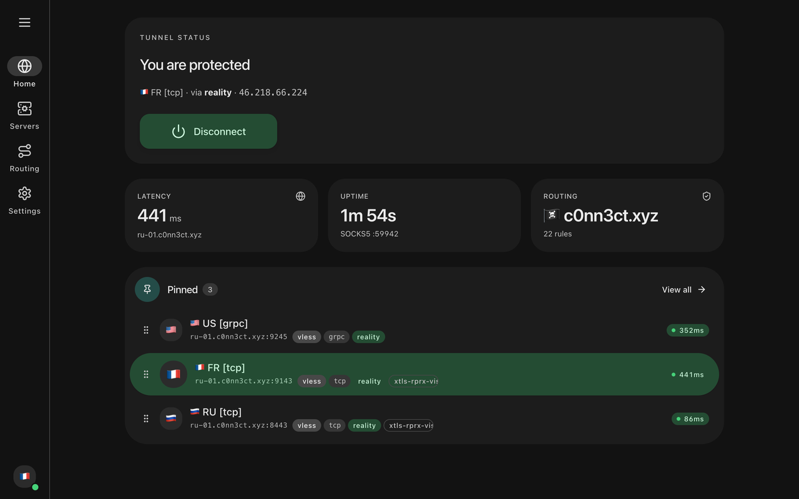

[English](./README.md) · [Русский](./README.ru.md)

<p align="center">
  <picture>
    <source media="(prefers-color-scheme: dark)" srcset="./media/logo-dark.png">
    
  </picture>
</p>

<p align="center"><strong>VLESS Browser Extension for Chrome</strong></p>
<p align="center"><em>Route browser traffic through your own proxies — without a system VPN.</em></p>

<p align="center">
  <a href="https://chromewebstore.google.com/detail/noctis/nmhobajopepdpihahepaddpdifdcenpn"></a>
  <a href="./docs/en/LICENSE.md"></a>
  <a href="https://github.com/c0nn3ct-xyz/noctis-host"></a>
  <a href="https://noctis.c0nn3ct.xyz"></a>
</p>

<p align="center">
  
</p>

> [!IMPORTANT]
> Noctis is a browser proxy — not a system VPN. Only Chrome traffic is routed; the rest of your OS stays on your real connection. The extension is free under a proprietary EULA; the native helper is open source (MIT).

Noctis is a free browser extension that routes Chrome through VLESS, VMess, Trojan, Shadowsocks, Hysteria2, Reality and other proxy servers via a local helper powered by sing-box. No system VPN, no separate client window — proxying stays inside the browser.

## ✨ Features

- **Servers from share links, QR, or subscription URLs** — Paste `vless://`, `vmess://`, `trojan://`, `ss://`, `hysteria2://`, `tuic://`, `wireguard://` — or scan a QR code. Subscription URLs auto-refresh on a schedule.
- **Per-rule routing** — Match by domain, GeoSite, or GeoIP. Each rule routes to proxy, direct, or block.
- **Three routing modes** — Global sends everything through the proxy. Rules only routes matches. Direct bypasses entirely.
- **Health checks + automatic failover** — Background latency probes; one-tap manual ping per server. Failing servers drop out of the active route.
- **Pinned-server shortlist** — Keep three favorites at the top of the popup. Switch active server without opening the full panel.
- **Live log stream** — sing-box stdout and stderr stream into the extension. Diagnose connection issues without leaving the browser.
- **WebRTC leak guard** — Optional toggle blocks UDP outside the proxy so WebRTC can't reveal your real IP.
- **Bundled ad and tracker block rules** — `geosite:ads` families route to block by default. Toggle off if you prefer to handle it elsewhere.

## 🔌 Supported proxy protocols

`VLESS` · `VLESS Reality` · `VMess` · `Trojan` · `Shadowsocks` · `Hysteria/2` · `TUIC` · `WireGuard` · `AnyTLS` · `ShadowTLS`

Noctis supports every transport sing-box exposes: VLESS (including VLESS Reality), VMess, Trojan, Shadowsocks, Hysteria2, TUIC, WireGuard, AnyTLS and ShadowTLS. Configs from V2Ray, Xray and 3X-UI panels work as-is — paste a share link or subscription URL and the extension translates it into a sing-box outbound automatically.

## 🧩 How it works

Browsers can't run a sing-box engine on their own. Three pieces split the work across the sandbox boundary — and the arrow that crosses it is the only place messages flow.

```
  Browser                                    Your machine
  ┌──────────────────┐  native messaging   ┌──────────────────┐
  │ Noctis extension │ ◀─────────────────▶ │  noctis-host     │
  │ popup · panel    │   events · logs     │ (native helper)  │
  │ options          │                     └────────┬─────────┘
  └────────┬─────────┘                              │ spawn · config
           │                                        ▼
           │                                ┌──────────────────┐
           │  Chrome proxy → SOCKS/HTTP     │     sing-box     │
           └───────────────────────────────▶│                  │
                                            └────────┬─────────┘
                                                     │ encrypted
                                                     ▼
                                            ┌──────────────────┐
                                            │  Proxy servers   │
                                            └──────────────────┘
```

sing-box is the open-source proxy engine that runs underneath Noctis. It's compatible with V2Ray and Xray configurations and supports VLESS, VMess, Trojan, Shadowsocks, Hysteria2, TUIC, Reality, AnyTLS, ShadowTLS and WireGuard out of the box. Noctis bundles a small native helper that supervises sing-box on your machine, so the browser extension only has to send routing decisions — never raw traffic.

## 📥 Install

The Noctis extension needs a small native helper running on your machine. The helper supervises sing-box, the engine that actually does the proxying.

### Before you start

- A Chromium-based browser, version 120 or newer (Chrome, Chromium, Edge, Brave, Arc, Vivaldi, Opera, Yandex Browser).
- About 50 MB of free disk for the helper and sing-box.
- No admin / root rights — everything installs into your user account.

### Install the extension

Install Noctis from the [Chrome Web Store](https://chromewebstore.google.com/detail/noctis/nmhobajopepdpihahepaddpdifdcenpn). Open the extension after install — it will detect that the helper is missing and show a setup dialog with a one-liner pre-filled for your machine.

### Run the helper installer

Copy the command from the extension's Helper Setup dialog and paste it into your terminal. Your extension ID is already filled in — you don't need to look it up. For reference, the command looks like this:

Helper source: <https://github.com/c0nn3ct-xyz/noctis-host>

**macOS**
```bash
curl -fsSL https://noctis.c0nn3ct.xyz/macos.sh | bash -s -- nmhobajopepdpihahepaddpdifdcenpn
```

**Linux**
```bash
curl -fsSL https://noctis.c0nn3ct.xyz/linux.sh | bash -s -- nmhobajopepdpihahepaddpdifdcenpn
```

**Windows (PowerShell)**
```powershell
$env:NOCTIS_EXT_ID='nmhobajopepdpihahepaddpdifdcenpn'; iwr -useb https://noctis.c0nn3ct.xyz/windows.ps1 | iex
```

The installer downloads noctis-host and sing-box into your user data directory and writes a native-messaging manifest for every supported browser.

The first time the extension talks to the helper, your browser may show a one-time native-messaging prompt — approve it.

### First run

Open the extension's popup, paste a `vless://`, `ss://`, or `trojan://` share link (or a subscription URL), and toggle the active server. The status badge turns green once sing-box accepts traffic.

### Updating

Rerun the one-liner for your OS — the script is idempotent and will replace the existing binaries.

### Uninstalling

1. Remove the extension from `chrome://extensions`.
2. Delete the Noctis data directory:
   - macOS / Linux: `~/.local/share/noctis`
   - Windows: `%LOCALAPPDATA%\Noctis`

## ❓ FAQ

**What is VLESS and why use it in a browser?**
VLESS is a lightweight proxy protocol from the V2Ray/Xray family. It carries no encryption of its own — TLS does that — so it's fast and easy to disguise as ordinary HTTPS. Using VLESS through a browser extension means only browser traffic is proxied; the rest of your operating system stays on your real connection.

**How is a browser proxy extension different from a VPN?**
A VPN tunnels every app on your system through one connection and usually needs admin rights. A browser proxy extension like Noctis only routes the browser, requires no root or admin, and lets you keep Zoom, Steam, Telegram desktop and torrents on your real network at the same time.

**Does Noctis support VLESS Reality?**
Yes. VLESS Reality is a standard sing-box outbound, and Noctis passes Reality parameters (Server Name, Fingerprint, SNI, Dest, public key, short ID) through to the helper unchanged. Paste a `vless://...flow=xtls-rprx-vision&security=reality` share link and the extension imports every field.

**Which proxy protocols does Noctis support?**
VLESS, VMess, Trojan, Shadowsocks, Hysteria2, TUIC, WireGuard, AnyTLS and ShadowTLS — anything sing-box supports as an outbound. V2Ray and Xray share links work as-is.

**Is a Chrome proxy extension safe to use?**
Safer than most. Noctis sends nothing to its developer — no analytics, no telemetry, no remote config. Server configs stay in browser storage. The native helper runs without admin rights. The full permission list and rationale is in the [privacy policy](./docs/en/PRIVACY.md).

**Does Noctis work on Windows, macOS and Linux?**
Yes — Chromium-based browsers on Windows, macOS and Linux (Chrome, Edge, Brave, Arc, Vivaldi, Opera, Yandex Browser). The native helper has one-line install scripts for each platform.

**Can I use a subscription URL to auto-update servers?**
Yes. Paste a subscription URL once and Noctis refreshes it on a schedule. Server lists update automatically; pinned and active selections survive refreshes.

**Will Noctis help bypass website blocks?**
Noctis itself is just a proxy client — it routes your browser through whatever server you provide. If your server is in a region where the site you want to reach is accessible, Noctis routes you there. It does not provide servers; you supply them.

**Does Noctis block WebRTC leaks?**
Yes. An optional toggle blocks UDP outside the proxy so WebRTC can't reveal your real IP while the proxy is active.

**How much does Noctis cost?**
Free. The extension is free in the Chrome Web Store and the native helper is open-source under MIT. You only pay for the proxy servers you choose to use.

## 🙏 Acknowledgments

- **[sing-box](https://github.com/SagerNet/sing-box)** — the proxy engine that does all upstream routing and encryption. Noctis is a control surface; sing-box does the actual work.
- **[V2Ray](https://github.com/v2fly/v2ray-core)** and **[Xray](https://github.com/XTLS/Xray-core)** — the upstream protocol designs (VLESS, VMess, Reality) that Noctis speaks via sing-box-compatible outbounds.

## ⚖️ Legal

- License — proprietary EULA: see [LICENSE](./docs/en/LICENSE.md) or <https://noctis.c0nn3ct.xyz/license/>.
- Privacy — see [PRIVACY](./docs/en/PRIVACY.md) or <https://noctis.c0nn3ct.xyz/privacy/>.
- Native helper — MIT-licensed: see <https://github.com/c0nn3ct-xyz/noctis-host>.
